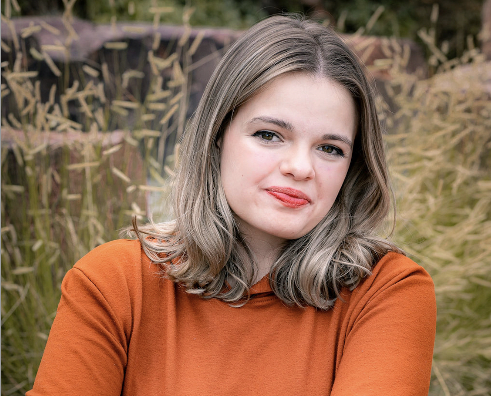

# Aucklynn Sacco 
- Email: asacco@mines.edu
- Location: Golden, CO

Enthusiastic and dedicated student pursuing a B.S. in Geophysics with a strong foundation in earth sciences, physics, and data analysis. Seeking opportunities to apply academic knowledge through internships or research projects to further develop skills and contribute to the field of geophysics.
## Education 
### Major in Geophysics, Minor in Data Science -  Expected May 2027
* *Colorado School of Mines - Golden, CO* *
GPA: 3.4						                                                                  
#### - Awards:
- **Harvey Scholar** Full tuition scholarship focused on leadership, community service, and paying it forward.
- **Deans List** Fall 2024
- **Honor Roll** Fall 2023, Spring 2024

### Duel Enrollment 
* *Red Rocks Community College, Lakewood, CO* * 
- Completed Completed Chemistry 1, Astrobiology, Intro to Shakespeare, Children’s Literature, English 112, Abnormal Psychology and Macroeconomics during junior and senior year of High School
- GPA: 3.97

## Work Experience 
### Co Director of Communication and Events
* *Undergraduate Student Government -  Colorado School of Mines - Golden CO: February 2024 - Present* * 
- Plan, organize, and execute internal and external events.
- Co-chair of the Outreach and Events team; manage communication via USG website and social media.
- Act in the best interests of USG; represent USG and its members to the Mines Administration. 
- Work on initiatives to improve campus life and address the needs of the undergraduate student body.

### Peer Mentor 
* *Colorado School Of Mines - Golden, CO: Feb. 2024 - Present* *
- Facilitated the transition for first-year students through orientation and ongoing academic support.
- Provided guidance and assistance to students to help their academic performance and adaptation to college life.
- Ensured a safe and supportive learning environment, collaborating with faculty to maximize student success.
- Organized activities to build self-esteem, promote team building, and foster creativity among mentees.
### Teaching Assistant 
* *Arvada Center -  Arvada, CO: Summer 2024* *
- Assisted lead instructor with the planning and execution of theatre classes for students aged 5 to 12.
- Facilitated classroom activities, including warm-ups, improvisation exercises, and get to know you games.
- Provided individual and group coaching to students on performance techniques, character development, and stage presence.
- Assisted with tasks such as maintaining attendance records, communicating with parents and guardians, and facilitating lunch/after class activities.
### Program Assistant
* *Colorado State University - Black Hawk, CO: Apr. 2022 - June. 2023* *
- Collaborated with the program coordinator to plan and coordinate daily programming and field trips.
- Led bi-weekly meetings and created training sessions on topics including social media, graphic design, and field-trip planning.
- Prepared and distributed team communications to enhance collaboration and team morale.
- Presented information about the EAGLE program and its impact at the Tony Grampsas Youth Services Program and the Shared Risk and Protective Factors Conference.
- Assisted with budget development, scheduling, and grant proposals.

## Skills 
Python, c++, R Studio, GitHub, Microsoft Teams, Microsoft Suite, Google Suite, Communication, Team Management, Team Work, Teaching,  Adaptability, Problem-Solving 

## Affiliations 
- Society of Women Engineers - Member
- Rockhounding Club - Member
- Thorson First year Honors

